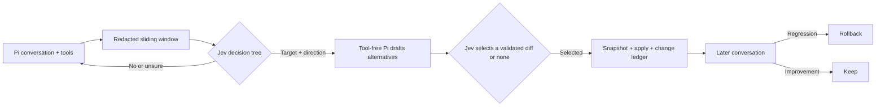

<p align="center"></p>
<h1 align="center">Agent Watch</h1>
<p align="center"><strong>A Pi harness that learns from the conversation.</strong></p>
<p align="center">Observe → ask Jev → draft alternatives → select an edit → watch what happens next.</p>
<p align="center"><a href="docs/architecture.md">Architecture</a> · <a href="docs/evaluations.md">Actual Jev questions</a> · <a href="docs/jev-decision-loop.md">Decision tree</a> · <a href="LICENSE">MIT license</a></p>

> [!WARNING]
> **Early prototype, not a production safety system.** The autonomous loop is not calibrated on real Pi traces, live Pi/Jev integration has only been exercised with synthetic tasks in disposable projects, and generated extension code is not sandboxed. Try the disposable demo first. Do not point autonomous mode at a sensitive or irreplaceable harness.

Agent Watch is a free, local-first CLI and web dashboard for [Pi](https://github.com/earendil-works/pi). A Pi extension observes recent user messages, tool outcomes, context files and skills. [Jev](https://www.learnjev.com/) answers a **series** of bounded questions: *Is a change warranted? Which observed component? What direction? Which exact validated diff? Did it help?* A separate tool-free Pi run drafts the alternatives. Deterministic code limits file access, stores a previous copy, and handles rollback. The transcript itself supplies the feedback; there are no rating prompts.



### See it safely in 60 seconds

Requires Node.js **22.13+** and `diff`. From a checkout of this repository:

```sh
npm run demo
```

The command opens a dashboard for a **new temporary project** with a fake documentation skill, synthetic conversation and **fixture Jev/Pi answers**. It writes only inside that temporary project. Try **Pause & rollback** to restore the fake skill, or disable/delete the fixture custom eval. No API key, real Pi session or change to your Pi configuration is needed for those actions. **Adding or editing** an eval calls your configured Pi model.

For a single **real Jev connectivity check**, export `TYPESAFE_API_KEY` in your own shell and run `npm run jev:smoke`. That request contains only a synthetic example and changes no files. Agent Watch never loads `.env` automatically or retrieves credentials from Pi, Keychain or another store.

### Try the observer in a disposable Pi project

Pi and `TYPESAFE_API_KEY` are required for a real evaluation. The npm package is **not published** yet; use the checked-out extension for now:

```sh
node src/cli.mjs setup --project /path/to/disposable-project
cd /path/to/disposable-project
pi -e /absolute/path/to/agent-watch/extensions/agent-watch.js
# In a second terminal:
node /absolute/path/to/agent-watch/src/cli.mjs open --project /path/to/disposable-project
```

Setup asks for per-project consent before sending redacted evidence to Jev and before enabling autonomous edits. It defaults to **off** without consent. The Pi extension connects to a local daemon; the dashboard binds to loopback with a short-lived token. If Jev or Agent Watch is unavailable, Pi should keep running and no autonomous edit should be applied.

CLI commands: `status`, `sessions`, `changes`, `review`, `evals`, `eval-add`, `eval-edit`, `eval-enable`, `eval-disable`, `eval-remove`, `pause`, `resume`, `rollback`, `open` (all accept `--project`). Pi commands: `/watch-status`, `/watch-review`, `/watch-pause`, `/watch-resume`, `/watch-rollback`, `/watch-open`.

### What does Jev evaluate today?

A seven-question built-in signal pack (correction, looping, progress, completion, tool fit, instruction adherence, error recovery) runs after settled turns with Jev consent. Its results are informational today. The separate autonomous tree runs only with Jev consent **and** autonomous mode enabled. It asks whether a harness change is warranted; chooses an observed project-local harness file and a component-specific direction; judges whether any drafted candidate is suitable; selects one validated candidate; then assesses later behavior. An uncertain or low-probability answer stops without changing files. [See every exact question, threshold and gap →](docs/evaluations.md)

Custom evals can be created in plain language:

```sh
node src/cli.mjs eval-add "Did the agent follow the user's requested scope?" \
  --schedule turn --every 10 --project /path/to/disposable-project
```

A tool-free Pi call proposes one typed Jev question. You **see and confirm** it before activation. Schedules are every N turns, after an agent settles, or on session shutdown. Edit, disable, or remove definitions in the dashboard or CLI. **These custom results are informational today**: they do not steer the autonomous decision tree. The built-in signal pack also does **not yet** change decisions or protect against regressions. See the [exact question pack and remaining gaps](docs/evaluations.md).

### Boundaries and limitations

- Autonomous edits are limited to **existing project-local Pi harness files**: `AGENTS.md`, `.pi/settings.json`, `.pi/skills/**/SKILL.md`, `.pi/prompts/*.md`, and `.pi/extensions/**/*.{js,ts}`. Application source and global Pi config are outside the allowlist.
- The drafter has **no tools** and cannot write a file. Code rejects invalid candidate syntax and conflicting file contents. **Syntax checks are not a security sandbox**; an extension that passes them can still be unsafe when Pi later loads it.
- Each applied diff and decision path is logged in `.agent-watch/changes.md`. A previous copy is stored in the local SQLite database. Pause rolls back a provisional edit unless someone changed the file afterward; Agent Watch then refuses to overwrite it.
- Common secrets are redacted before persistence or remote evaluation, but pattern matching cannot guarantee removal of every secret. Review the data you expose. Local SQLite, spools, sockets and config are Git-ignored. External Jev and Pi model calls may incur provider charges.
- Absolute cost/time/tool-error limits supplement Jev's judgments. The prototype thresholds are **uncalibrated**; observing later turns does not prove that an edit caused a better outcome.

### Understand or extend it

- [Architecture and data flow](docs/architecture.md)
- [Six-stage Jev decision tree](docs/jev-decision-loop.md) · [standalone HTML explainer](docs/jev-decision-loop.html) (open locally in your browser)
- [Exact current evals and known gaps](docs/evaluations.md)
- [Video-friendly architecture diagram](mockups/define-agent-watch/architecture-video.html) (open locally)
- [Bundled Pi skill](skills/agent-watch/SKILL.md): use `/skill:agent-watch` when editing questions or scheduling evals in a source checkout.

Contributing? Clone the source, read the eval reference, change the smallest relevant branch, update a focused test and the docs, then run:

```sh
npm test
npm run build
npm run demo
```

The tests use fake Jev responses and disposable projects; they do not require credentials. A synthetic end-to-end Pi/Jev run has passed in a disposable project; before/after calibration on real tasks still needs community testing. Please report unexpected file changes or privacy concerns privately before posting sensitive traces in a public issue.
