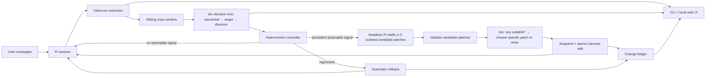

# Agent Watch architecture

Agent Watch is a continuous, autonomous improvement loop for Pi. The transcript is the feedback signal: user corrections, repeated requests, tool failures, successful actions, loaded skills, and later turns show whether the harness helped or hurt.

## The loop

1. **Observe** — A Pi extension records user messages, assistant turns, tool calls/results, active tools, loaded skills, model settings, and harness configuration.
2. **Window** — Agent Watch maintains a rolling window of the current task and recent turns instead of repeatedly judging the full session.
3. **Measure, then decide** — One batched Jev request records informational correction/progress/loop/completion/tool-fit/adherence/recovery signals after each settled response. Separately, Jev first judges whether *any* harness change is warranted. Only then does it choose an observed component and a component-specific improvement direction. Each answer determines the next question; uncertain paths stop and keep observing.
4. **Choose an improvement** — Once Jev selects a direction, a separate headless Pi run drafts two or three distinct project-local harness patches in isolation. Code rejects invalid or forbidden patches. Jev judges whether any candidate is suitable, then chooses a specific surviving patch or `none`; the improver never selects its own winner. The full tree lives in [Jev decision tree](jev-decision-loop.md).
5. **Record** — Before applying Jev's chosen patch, Agent Watch saves the previous contents. It appends the evidence, alternatives, selection, diff, and status to `.agent-watch/changes.md`.
6. **Verify continuously** — Later user messages and tool behavior become the validation set. If the same signals improve, the change stays. If they regress, Agent Watch restores the previous snapshot and records the rollback.

## Components

### Pi observer

A lightweight Pi package extension. It only captures events and updates the Pi status widget; evaluation and improvement run outside the Pi process.

Useful Pi hooks:

- `input` — raw user messages
- `before_agent_start` — active tools, skills, instructions, and context files
- `turn_end` — completed assistant turn and tool results
- `tool_execution_end` — tool outcome and errors
- `agent_settled` — safe evaluation boundary
- `session_shutdown` — final flush
- `ctx.sessionManager` — complete session tree and active branch

### Local daemon

A single background process receives observer events, maintains sliding windows, calls Jev, launches headless Pi improvement runs, owns snapshots, and performs rollback. The extension reconnects automatically and spools events locally if the daemon is briefly unavailable.

### Jev evaluator

Jev acts as successive semantic `if` statements: warranted? which observed component? which direction? is any draft suitable? which exact diff? did it help? Noul, Choice, and Score answer bounded questions; code builds each next branch and enforces thresholds, budgets, file boundaries, and side effects. See [Jev decision tree](jev-decision-loop.md).

### Headless Pi improver

A separate Pi session drafts small alternative harness changes in isolation. Jev chooses among the valid diffs; only then does the controller apply one. It cannot modify application source, global Pi configuration, credentials, or Agent Watch's own history.

### Change ledger

`.agent-watch/changes.md` is the human-readable source for what changed. Each entry contains:

- timestamp and change ID
- affected file
- triggering trace/session references
- Jev question, probability, and threshold
- concise reason
- unified diff
- status: active, kept, or rolled back
- rollback reason when applicable

Internal snapshots can live in Agent Watch's local data directory; the project ledger remains readable without the daemon or UI.

### CLI and local web UI

These are visibility and control surfaces over the same daemon. They show the live window, evaluations, harness changes, and rollback history. They are not a separate workflow engine.

## Guardrails

- Redact common secrets and excluded paths before persistence or remote evaluation.
- Mutate only project-local Pi harness files.
- Make one change per finding.
- Apply changes atomically and never overwrite conflicting user edits.
- Keep deterministic limits for cost, turns, tool errors, and change frequency.
- `/watch-pause` immediately stops the loop and rolls back an active unverified change.
- Every autonomous action must be reconstructable from the ledger.

## First vertical slice

1. Capture Pi turns, tool results, active tools, skills, and harness files.
2. Build a rolling trace window.
3. Ask Jev whether any harness change is warranted after settled turns.
4. If warranted, ask Jev successively which observed component and what improvement direction fit the evidence.
5. Launch one headless Pi run to draft two or three isolated candidate diffs.
6. Reject invalid candidates, then ask Jev whether any draft is suitable and which specific diff to choose, or none.
7. Apply the selected project-local harness diff with snapshot and ledger entry.
8. Keep or roll back the change from subsequent sliding-window evaluations.
9. Expose status and history in the CLI; add the local web view over the same records.
