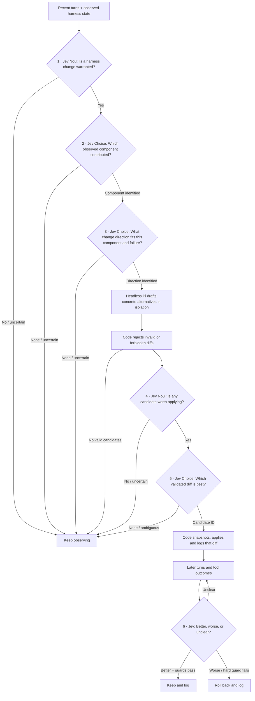

# Jev decision tree

[View the standalone visual explainer](jev-decision-loop.html).

**This is the decision structure for Agent Watch.** Jev is the semantic `if` in a succession of conditional decisions. Code takes each answer, decides whether to stop, and constructs the *next* question and its available choices. We do not ask one model call to diagnose, choose a fix, and judge its result all at once.

The observed Pi transcript is the feedback: later user corrections, repeated requests, tool and skill use, results, errors, and subsequent outcomes. No explicit rating prompt is required. Jev judges that evidence; it does not generate text or edit files.

## How each branch works

| Gate | Jev question | Available answers come from | If uncertain |
| --- | --- | --- | --- |
| 1. Warranted? | **Noul:** Is there evidence that a *harness* change would help, rather than the agent simply needing to continue or fix the user's task? | Current task, recent turns, correction signals, tool outcomes, and deterministic counts. | Observe more; do not draft. |
| 2. Where? | **Choice:** Which observed harness component most contributed to this failure? | Components actually present in the trace and local harness inventory: a loaded skill, instruction file, prompt, extension, tool setting, etc.; include `none`. | Observe more; do not force a target. |
| 3. How? | **Choice:** Which direction could improve that component for this specific failure? | A small component-specific menu constructed from its configuration and the failure: e.g. narrow a skill's trigger, clarify its instructions, adjust its scope, or `none`. | Observe more; do not invent a generic fix. |
| 4. Worth applying? | **Noul:** Is any *valid* draft likely to address this failure without unacceptable collateral effects? | Trace evidence, target, selected direction, and surviving candidate diffs. | Do not apply. |
| 5. Which exact edit? | **Choice:** Which candidate ID best addresses the evidence with the smallest suitable change? | Two or three distinct, already-validated diffs drafted by headless Pi; include `none`. | Do not apply. |
| 6. Did it help? | **Score** or **Noul**, compared with the baseline: has the original failure signal improved in subsequent turns? | Later user messages and tool outcomes, alongside deterministic guard metrics. | Keep observing; do not declare success. |

The *first question* is deliberately only “is any change warranted?” Later calls are conditional on earlier answers. Independent signals needed at the same gate (for example, correction and looping) may be batched in one Jev request; dependent gates must wait for the prior result. The exact number of calls varies by path.

## Where the choices come from

There is no universal list of all possible improvements. Code enumerates eligible targets from what Pi actually used and what project-local harness files exist. Once Jev selects a target, code builds a **target-specific menu** of applicable change directions. Once Jev selects a direction, a separate headless Pi run drafts concrete alternatives. Jev then chooses the actual validated diff. If the right target, direction, or diff is absent from the options, Jev cannot select it: record the miss and improve the candidate-generation rules later, rather than pretending a forced winner is correct.

A `Choice` always ranks the choices it receives. Adding `none` is useful but does **not** by itself prove that any change is warranted. Pair relative choices with an absolute Noul gate and a policy that defers ambiguous answers. Treat probability distributions as decision evidence, not as explanations. Thresholds and persistence rules need calibration on labeled traces; this document does not assign arbitrary universal cutoffs.

## Example: wrong documentation skill

1. User: “Update the public API docs.” The agent loads `internal-docs`, edits internal docs, and the user replies: “No, I meant the public API.”
2. **Gate 1:** Jev judges whether the correction points to a recurring harness problem, rather than simply an incomplete task. If not, stop.
3. **Gate 2:** Choices are the observed `internal-docs` skill, relevant project instructions, or `none`. Jev picks the skill.
4. **Gate 3:** Skill-specific choices: narrow its activation description; clarify the public/internal distinction inside the skill; leave it unchanged. Jev chooses a direction.
5. Headless Pi drafts two different edits in an isolated workspace. Code checks the paths, diffs, base snapshot, and local tests.
6. **Gates 4–5:** Jev judges whether any draft is appropriate, then picks one candidate ID or `none`. Only the selected validated diff can be applied.
7. Future Pi sessions provide new evidence. Jev judges semantic improvement; deterministic checks catch cost, errors, and file conflicts. Keep, wait, or roll back.

## Boundary between model and code

- **Jev:** bounded semantic predicates, target/direction/candidate selection, and outcome judgments. It does not write patches or supply free-text rationales.
- **Headless Pi:** generates a few concrete diffs within the selected target and direction, in isolation. It does not choose which diff goes live.
- **Controller code:** redacts evidence before persistence or remote evaluation; builds eligible option sets; enforces allowed files, budgets, repeat-evidence rules, scheduling, minimum evidence, snapshot consistency, atomic application, and rollback. It never treats a Jev answer as permission to bypass a hard rule.
- **Ledger:** `.agent-watch/changes.md` records the question and answer at every gate, full Choice distributions, option sets, linked trace evidence, selected candidate, diff, and keep/rollback decision. Generated explanations, if present, are labeled as such—not attributed to Jev.

A user may write adversarial text into a transcript. Treat it as evidence, not instructions for the evaluator or controller. If Jev, the improver, or Agent Watch is unavailable, Pi continues normally and no change is applied.

## Still to resolve through testing

- Window size and how many repeated signals justify gate 1.
- How component-specific change-direction menus are assembled and extended.
- Calibration for deferring uncertain choices and for the final keep/rollback decision.
- How to compare later tasks with the original failure without treating different user goals as identical tests.
